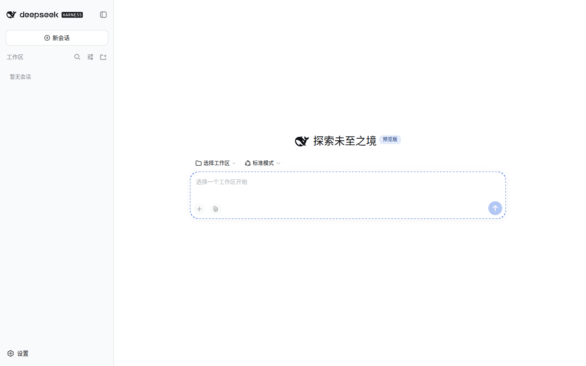
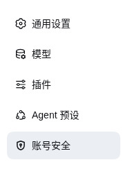
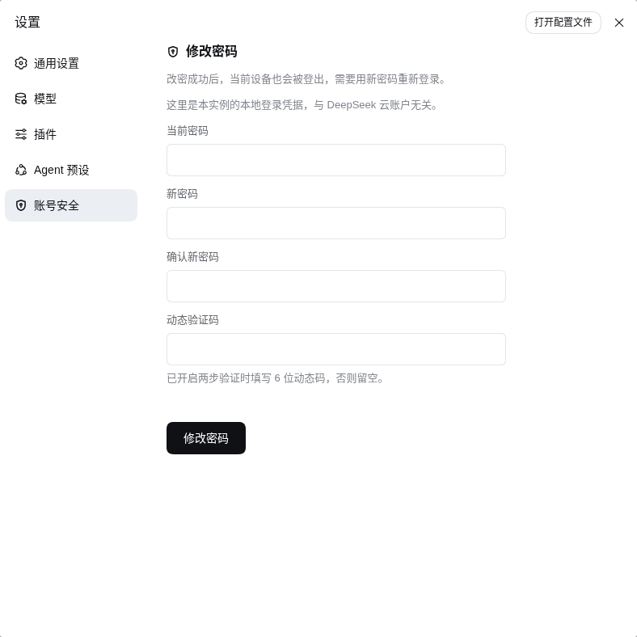

# dsh-auth-gate

[English](README.md) | **简体中文**

[](https://www.npmjs.com/package/dsh-auth-gate)
[](https://www.npmjs.com/package/dsh-auth-gate)
[](https://www.npmjs.com/package/dsh-auth-gate)
[](https://www.npmjs.com/package/dsh-auth-gate)
[](https://www.npmjs.com/package/dsh-auth-gate)
[](https://github.com/TecFancy/dsh-auth-gate/actions/workflows/ci.yml)
[](LICENSE)

给 [DeepSeek Harness](https://github.com/deepseek-ai/dsh)（dsh）网页版加一道登录门。部署到
公网 dsh 实例前面之后，不登录就没人能碰到你的 agent、聊天会话和 LLM 凭证。

> **在 dsh 官方推出认证功能之前，本仓库会一直维护。** dsh 目前还没有内置登录，这个仓库就是
> 用来补上这道门的：我们持续跟进 dsh 新版本（挂载点、版本走廊、Linux/Windows 双平台 CI）、
> 修复回归、正常发版。等官方认证落地，我们会给出迁移说明，并继续支持大家仍在用的 dsh 版本 -
> 不会把人丢在一个没人管的 fork 上。

## 目录

- [它能做什么](#它能做什么)
- [它不做什么](#它不做什么)
- [快速开始](#快速开始)
- [效果预览](#效果预览)
- [配置](#配置)
- [命令行工具](#命令行工具)
- [内置配置技能](#内置配置技能)
- [故障排查](#故障排查)
- [部署](#部署)
- [认证本地代理（可选）](#认证本地代理可选)
- [环境要求](#环境要求)
- [注意事项与局限](#注意事项与局限)
- [开发](#开发)
- [许可证](#许可证)

## 它能做什么

- **所有访问都要先登录。** 每个页面、每个 API 调用、每条 WebSocket 连接都会检查；
  没有有效会话的访客会被带到简单的登录页（API/脚本请求则返回 `401`）。唯一例外是
  `GET /manifest.webmanifest`：浏览器抓 Web App Manifest 时不带凭证，所以这条精确
  路径公开（只含应用名 / 图标 / 显示模式）。
- **两种登录方式**（配置里二选一）：
  - **密码**（推荐）：每个管理员一个用户名和密码。
  - **令牌**：整个实例共用一个秘密令牌。
- **浏览器和脚本都能用。** 浏览器走登录页；脚本和 curl 直接带
  `Authorization: Bearer <token>` 就能跳过登录页。
- **可选两步验证（TOTP）。** 密码模式下，账号绑定了 TOTP 密钥的用户登录时需要
  密码**加**验证器 App 的 6 位动态码（RFC 6238；配置 off/optional/required 三态）。
- **默认就安全。** 密码只存哈希、登录有限速（反复输错会临时锁定该地址）、会话 cookie
  带安全属性，而且配置缺失或损坏时**拒绝访问而不是悄悄开门**。用户名或密码错误时，登录卡会
  就地重渲染并显示 `Invalid username or password.`：用户名保留、密码需重输；触发锁定
  （HTTP 429 + `retry-after`）时同一张卡会显示剩余秒数与「仅限本网络」的提示——**刻意不显示
  还能试几次**；开着 JS 时刷新页面不再多消耗一次失败。

## 它不做什么

先把边界说清楚，方便你安装前评估风险（完整清单与机制见
`docs/deployed/known-limitations_zh.md`）：

- **不是服务器级安全。** 操作系统账号和配置文件仍要自己看好（`auth/users.yaml`、
  `.credentials.yaml` 生成时即 `0600`）；本插件只守 dsh 的 **Web** 面。
- **不是所有改口令入口都会踢会话。** `dsh-auth user disable` 会吊销该用户已发会话；
  设置面板的自助改密会吊销该用户的全部会话；CLI 的 `dsh-auth user passwd` 只改哈希。
- **不替代 HTTPS。** 配了 `cookieSecure: true` 就必须用 https 提供站点。
- **不是完整 IdP。** 没有 OAuth/OIDC、没有自助注册、没有邮件重置；用户由管理员通过
  CLI 创建和管理。

## 快速开始

```sh
# 1. 从 npm 装进你的 dsh profile。
#    0.4.1 起包声明了 dsh.bundle manifest，`dsh plugin add` 会同时自动注册挂载
#    （dsh.profile.bundles），无需手动写挂载行：
dsh plugin --profile web add dsh-auth-gate

# 2. 创建管理员账号。
#    `dsh plugin add` 把插件装进 profile 的 node_modules
#    （$DSH_HOME/profiles/web，默认 ~/.dsh/...），CLI **不会**进你的 PATH，
#    所以要经由 profile 调用。`dsh plugin` 本来就要求有 pnpm：
printf '%s\n' '选一个强密码' | \
  pnpm --dir "$DSH_HOME/profiles/web" exec dsh-auth user add admin --password-stdin

# 3. 开启密码登录：在 $DSH_HOME/cordis.patch.yml 里覆盖插件配置
#    （仓库自带现成配置覆盖模板 deploy/cordis.patch.yml，见下方"配置"——挂载本身
#    不需要手动 patch 行）

# 4. 重启 dsh，打开你的站点——会先要求登录。
```

## 效果预览

未登录的访客会被带到登录页（登录卡由插件在服务端渲染成英文，所以这张图与界面语言无关）：


账号启用了两步验证（TOTP）时，登录还会继续第二步——输入验证器 App（1Password、
Google Authenticator 等）里的 6 位验证码（先密码、后验证码）：


登录后进入你的实例：



在 dsh 0.1.2-alpha 及更高版本（页面有 launch token 门）上，登录会自动桥接这道门：
登录跳转会先经过一次相对 `/?token=…` 的短跳、mint 好 dsh cookie，再落到 `/`
（详见 `docs/implemented/impl-launch-token-bridge_zh.md`）。

设置面板里有一个醒目的**「退出登录 / Sign out」**按钮——在 **设置 → 通用设置**
页的最下方（最后一条设置项之后）。它是居中排布的填充式危险按钮（16px 门形图标 +
本地化文字，配色用主题 token、深浅色自适应）；文案跟随界面语言（复用「设置」里
语言切换的同一套 locale 机制）；点击走原有的原生 `POST /auth/logout?next=/` 登出流程。

已登录用户还可以在设置面板的**「账号安全」**分区里自助改密（仅 password 模式）：当前口令、
输入两次的新口令，账号绑定了 TOTP 时再加一枚验证码。面板标题旁是本插件自设计的图标
（16px outline「盾 + 钥匙孔」）。

导航行里那一枚同样是本插件的图标：宿主目前没有给单个设置页配图标的入口（`settings.section`
只有 `id`/`order`/`label`，导航图标由宿主硬编码的 `navIcon(id)` 决定，第三方分区一律默认齿轮），
所以插件用一层**临时 DOM 垫片**只替换自己那一行（找不到就静默退回齿轮）。dsh 官方支持
`icon` 选项后，这层垫片与其代码会整体删除（迁移条件见 ADR D24.1）。





面板向 `POST /auth/password` 提交（`current` / `password` / `code`，form-urlencoded）；
成功后**该用户的全部会话都会被吊销，包括发起改密的当前会话**，客户端**立即**把当前设备送回
登录页并带上原因，登录卡片会说明"为什么被登出"（成功态面板只在导航被环境拒绝时才会停留，
那上面的「重新登录」按钮是兜底出路）：


新口令要求至少 14 位、覆盖四类字符、且不得与当前口令相同。启用 TOTP 时，当前 30 秒窗口内
已用过的验证码会被判重放，需等下一枚。

## 配置

bundle 挂载行（id `dsh-auth-gate`，由 `dsh plugin add` 自动插入）使用默认配置：
`mode: "token"`，由 `DSH_AUTH_TOKEN` 环境变量提供共享秘密。要改配置，在
`$DSH_HOME/cordis.patch.yml`（或 profile 的 `cordis.patch.yml`）里按 id 覆盖——
仓库自带现成覆盖模板 `deploy/cordis.patch.yml`。注意：覆盖条目**不要带 `insert`**
（否则会二次挂载插件），只覆盖 config：

```yaml
- id: dsh-auth-gate
  config:
    mode: "password" # "password"（推荐）或 "token"
    totp: "optional" # "off"（默认）、"optional" 或 "required"
    cookieSecure: true # 使用 https 时保持 true
```

| 选项            | 默认值             | 作用                                                                                                                                                                                         |
| --------------- | ------------------ | -------------------------------------------------------------------------------------------------------------------------------------------------------------------------------------------- |
| `mode`          | `"token"`          | `"password"` = 用户名密码登录；`"token"` = 一个共享秘密                                                                                                                                      |
| `totp`          | `"off"`            | 仅密码模式。`"optional"`：绑定了 TOTP 密钥的用户登录需密码+动态码；`"required"`：所有用户都必须有密钥（无密钥/未知用户在密码阶段即统一 401，与错密同响应体，防枚举）                         |
| `sessionTtl`    | `604800`           | 一次登录持续多久（秒），到期需重新登录                                                                                                                                                       |
| `cookieName`    | `dsh_auth`         | 会话 cookie 的名字（很少需要改）                                                                                                                                                             |
| `tokenRef`      | `"DSH_AUTH_TOKEN"` | 仅令牌模式：共享秘密存在哪个环境变量里                                                                                                                                                       |
| `cookieSecure`  | `true`             | 只在纯 http 测试环境设为 `false`                                                                                                                                                             |
| `usersFile`     | `""`               | 密码模式：用户列表文件位置。默认 `$DSH_HOME/auth/users.yaml`                                                                                                                                 |
| `publicHost`    | `""`               | 登录页身份块显示的域名（反钓鱼的「这是哪个实例」那行）。空 = 用请求头 `Host`；反代改写了 `Host` 时（如 Caddy `header_up Host 127.0.0.1:3080`）必须显式配置，否则卡片显示回环地址而非公网域名 |
| `revokeSweepMs` | `5000`             | 密码模式：被 `dsh-auth user disable` 禁用的用户，其**已发**会话多久内（毫秒）被吊销。`0` = 不扫描（禁用只拦新登录）                                                                          |
| `logoutOrder`   | `1000`             | 「退出登录」按钮在 设置 → 通用设置 页的槽位顺序（越大越靠底）。若有其他插件注册了更大的 order，可调大此值                                                                                    |

给用户开启 TOTP：运行 `dsh-auth user totp enable <name>`，把打印出的密钥（或
`otpauth://` URI 二维码）录入验证器 App（Google Authenticator、1Password 等）。
动态码每 30 秒变化一次；前后一个窗口内的码也接受（容忍时钟漂移）。

## 命令行工具

`dsh-auth` 用命令行管理用户：

```sh
dsh-auth user add admin --password-stdin   # 添加用户（加 --admin 直接建管理员）
dsh-auth user list                          # 查看用户
dsh-auth user passwd admin                  # 改口令（读两次；刻意不提供 --password 明文参数）
dsh-auth user role admin user               # 授予/回收 admin 角色：user role <name> <admin|user>
dsh-auth user disable admin                 # 禁止某用户今后登录，并吊销其已发会话
dsh-auth user totp enable admin             # 生成 TOTP 密钥（打印 otpauth:// URI）
dsh-auth user totp disable admin            # 移除 TOTP 密钥
```

全局安装时 `dsh-auth` 直接在你的 PATH 上；`dsh plugin add` 安装后二进制在 profile 里，
需要经由 profile 调用 - 见[快速开始](#快速开始)。

`dsh-auth user passwd` 只改存储的哈希，**不会吊销该用户已登录的会话**；需要踢会话时用
设置面板的自助改密（或 `user disable`）。

## 内置配置技能

本包随附一份配置速查技能（`.agents/skills/dsh-auth-gate-config/`，即本页内容）。
把它安装到用户级技能目录后，部署侧的 dsh agent 就能直接回答「auth-gate 支持哪些配置」：

```sh
pnpm --dir "${DSH_HOME:-$HOME/.dsh}/profiles/<profile>" exec dsh-auth skill install [--force]
```

该命令把技能复制到 `$DSH_HOME/skills/dsh-auth-gate-config/`，dsh 技能发现机制会自动
加载。重复执行不带 `--force` 会保留你对技能的本地修改；`--force` 从包内刷新。

该技能是**仅用户可用技能**（frontmatter 里 `disable-model-invocation: true`）：
它不会出现在模型的可自动调用技能目录中（不常驻每一轮 agent 上下文），需要查配置时
在技能面板显式打开即可（输入框 `/` 菜单里标记 `仅用户`）。若希望 agent 自动回答配置
问题，安装后移除该 frontmatter 字段即可。

## 故障排查

### `dsh-auth: command not found`

`dsh plugin --profile web add dsh-auth-gate` 把包装进 profile 的 `node_modules`
（`$DSH_HOME/profiles/web/node_modules/dsh-auth-gate`，默认 `~/.dsh/...`），
但不会往你的 shell `PATH` 里加任何东西，所以 CLI 二进制不能直接用名字调用。
这只影响 CLI——插件本身运行正常。任选其一：

1. **经由 profile 调用（推荐）。** `dsh plugin` 本来就要求有 pnpm，让 CLI
   从插件所在的同一位置解析：

   ```sh
   pnpm --dir "${DSH_HOME:-$HOME/.dsh}/profiles/web" exec dsh-auth user add admin --password-stdin
   pnpm --dir "${DSH_HOME:-$HOME/.dsh}/profiles/web" exec dsh-auth user list
   ```

   可选，每个 shell 会话加一次：

   ```sh
   alias dsh-auth='pnpm --dir "${DSH_HOME:-$HOME/.dsh}/profiles/web" exec dsh-auth'
   ```

2. **直接用 node 调用**（运行时不依赖 pnpm）：

   ```sh
   node "$DSH_HOME/profiles/web/node_modules/dsh-auth-gate/lib/cli.js" user add admin --password-stdin
   ```

3. **全局安装**，`dsh-auth` 就会在你的 PATH 上：

   ```sh
   npm install -g dsh-auth-gate
   dsh-auth user add admin --password-stdin
   ```

无论哪种调用方式，CLI 读写的是同一份共享用户列表
（`$DSH_HOME/auth/users.yaml`，兜底 `~/.dsh/auth/users.yaml`，即插件读取的
那份）——全局安装的包只是启动器。

## 部署

- [反代部署指南](docs/deployed/reverse-proxy_zh.md) —— Caddy/nginx 配置、浏览器信任栅栏的坑
  （反代后设置页 `403`，以及为什么只加认证修不了它）、推荐的半外壳拓扑。
- [docs/deployed/deployment_zh.md](docs/deployed/deployment_zh.md) —— 运维清单、验收步骤（A–I）与故障诊断。

## 认证本地代理（可选）

> ⚠️ **已知限制（重要，任何 auth-gate 版本都不改变）**：dsh 的设置页（"设置 → 模型"等）
> 只允许在**页面 origin 为回环**（`localhost`/`127.x`）时编辑。这是 dsh 客户端
> （`isLoopback` 检查）的设计边界，与认证正交——**域名页面打开设置弹框会显示
> "settings are unavailable in this browser"，无法编辑提供方/凭据，升级 dsh-auth-gate
> 也无法改变**。要编辑配置，请用本节的本地代理，或直接在服务器上访问
> `http://127.0.0.1:3080`。域名页面的聊天与模型选择不受影响。

> 半外壳解决服务端 `/api` 栅栏后，dsh **客户端**还要求"页面 origin 必须回环"：域名页面下
> 设置页报 "settings are unavailable in this browser"（与认证无关）。`dsh-auth-proxy`
> 在用户本机提供回环页面入口，配合 auth-gate 实现"远程编辑配置 + 全程认证"，
> 不修改 dsh 源码。详细设计见 [docs/deployed/local-proxy_zh.md](docs/deployed/local-proxy_zh.md)。

- 零依赖 Node bin（`dsh-auth-proxy`）：严格绑定 `127.0.0.1`、无状态透传页面/API、
  `events.mux`/`events.host` WebSocket 隧道、`Set-Cookie` 去 `Secure` 适配（Safari 兜底）。
- 认证复用 auth-gate（密码/令牌模式均可）：登录页与会话 cookie 原样透传。
- **安全边界（deny-list，Phase 2.1）**：配合 `--mark-proxy`，服务端 guard 对标记请求中的
  `host.pickDirectory`/`host.openPath`/`settings.openDocument`/`llm.discoverModels` 返回 403，
  防止远程认证用户触发宿主原生能力；未开启标记时行为与未部署代理完全一致。

```sh
dsh-auth-proxy --listen 127.0.0.1:8443 --target https://your-domain.example --mark-proxy
# 浏览器打开 http://127.0.0.1:8443 → 登录 →「设置 → 模型」即可编辑
```

systemd 示例：`deploy/systemd/dsh-auth-proxy.service.example`。

## 环境要求

- 服务器上需要 Node ≥ 22.19 和 pnpm。
- dsh `0.1.x`（声明为 `engines.dsh: ^0.1.0-rc.6 || ^0.1.5-rc.2 || ^0.1.7-alpha.1`）。
  运行时验证对应 `0.1.5-rc.2`（生产）与 `0.1.7-alpha.1`（隔离实例）；`0.1.6-*`
  预发布版未列入枚举，因为没有针对它们的版本验证（稳定版 `0.1.6` 由
  `^0.1.5-rc.2` 覆盖）。插件用的是宿主自己那份 `@deepseek-ai/dsh-storage-domain` 与
  `@deepseek-ai/cordis`（两者都是 peer 依赖，不随插件打包），所以只要 profile 由 dsh
  基础包启动，依赖就齐了。
- dsh 的 `web` profile 正常运行（`dsh --profile web`）。
- 如果 `cookieSecure` 是 `true`，站点必须走 https（浏览器在纯 http 下会拒绝安全 cookie）。

## 注意事项与局限

这里只列用户可见的部分；完整清单（含机制与 ADR 出处）见
`docs/deployed/known-limitations_zh.md`。

- 禁用用户只挡**今后**的登录；已经登录的会话到 TTL 到期前仍然有效。
- 登录限速与 TOTP 同窗重放防护会在服务重启后清零。
- 放在反向代理后面时必须配 `clientIpHeader`（以及 `trustedProxyCidrs`），否则所有
  客户端共用同一个锁定桶 - 登录与自助改密各有一个桶。
- 改密成功后即使"吊销旧会话"失败也依然按成功返回：失败会记 error 日志，旧 cookie 到
  会话 TTL 到期前有效。
- 本插件只保护 dsh 的 Web 面；操作系统账号与配置文件要自己保持私有。

## 开发

本仓库遵循 [dsh-plugin-framework](https://github.com/TecFancy/dsh-plugin-framework)
的工程约定：跨 slice 只走 barrel、以 `npm run verify` 为门禁链、决策记录纪律。`verify`
依次跑 format / lint / no-emdash / slice / lock / decisions / docs / readme-parity /
type-check / 覆盖率 80% / build / bundle；测试、构建与发版流程见
`docs/specs/development_zh.md`。

## 许可证

[MIT](./LICENSE)
