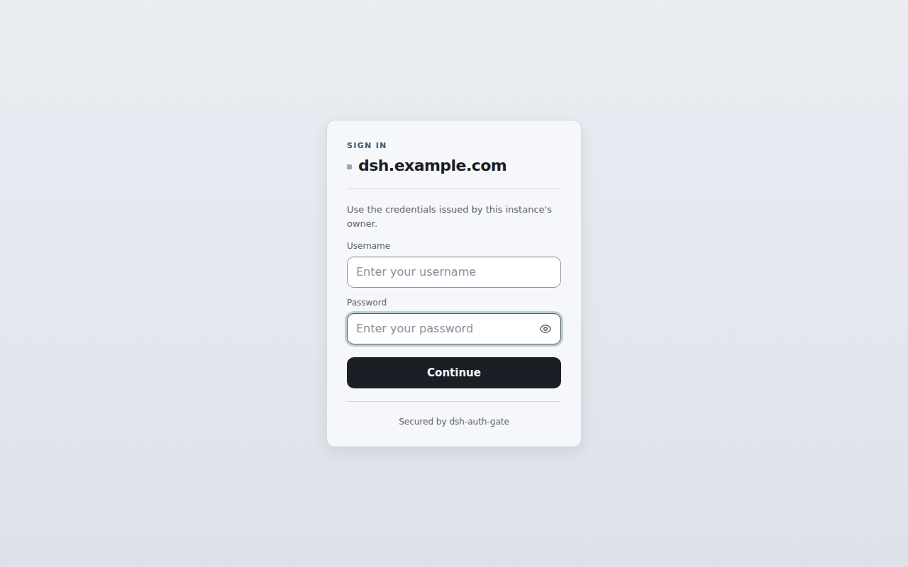
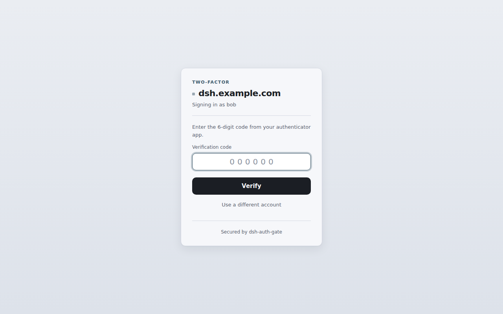
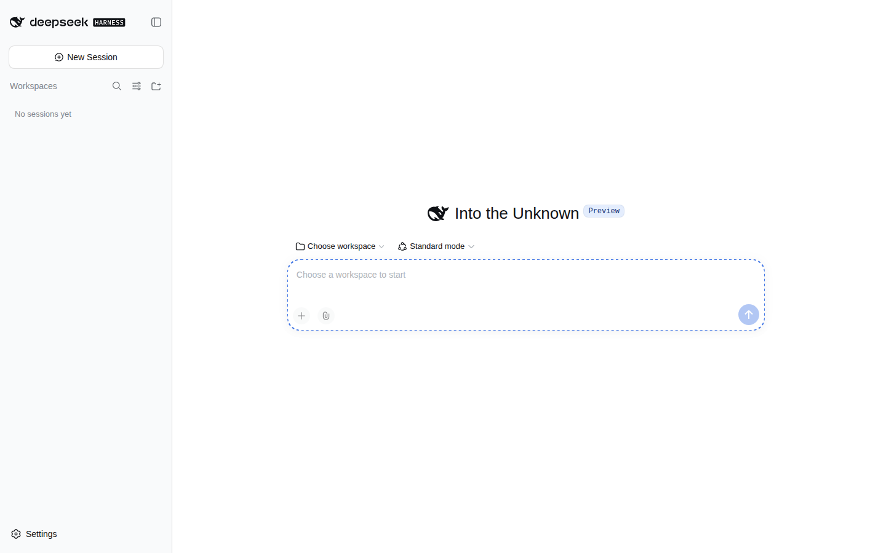
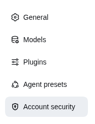
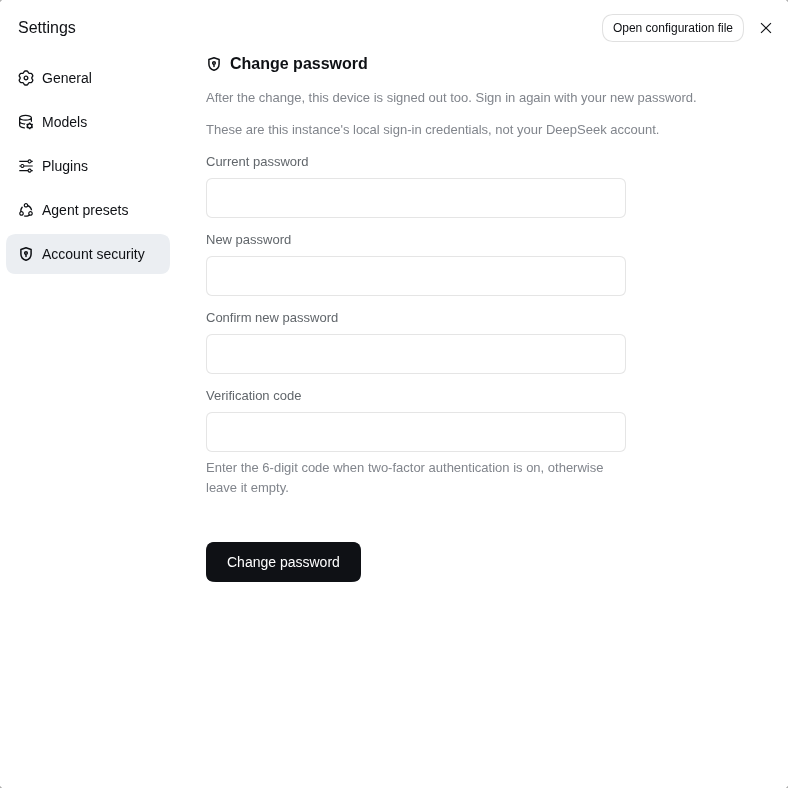
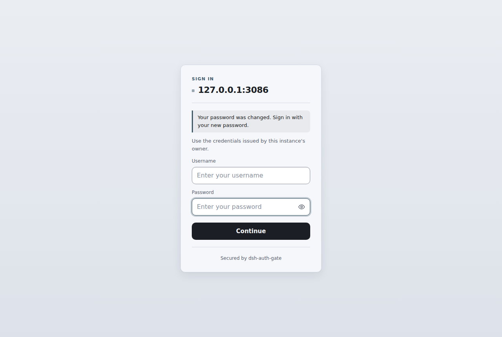
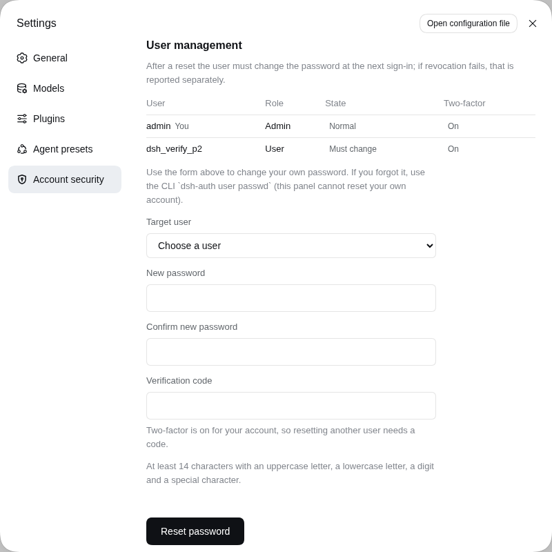
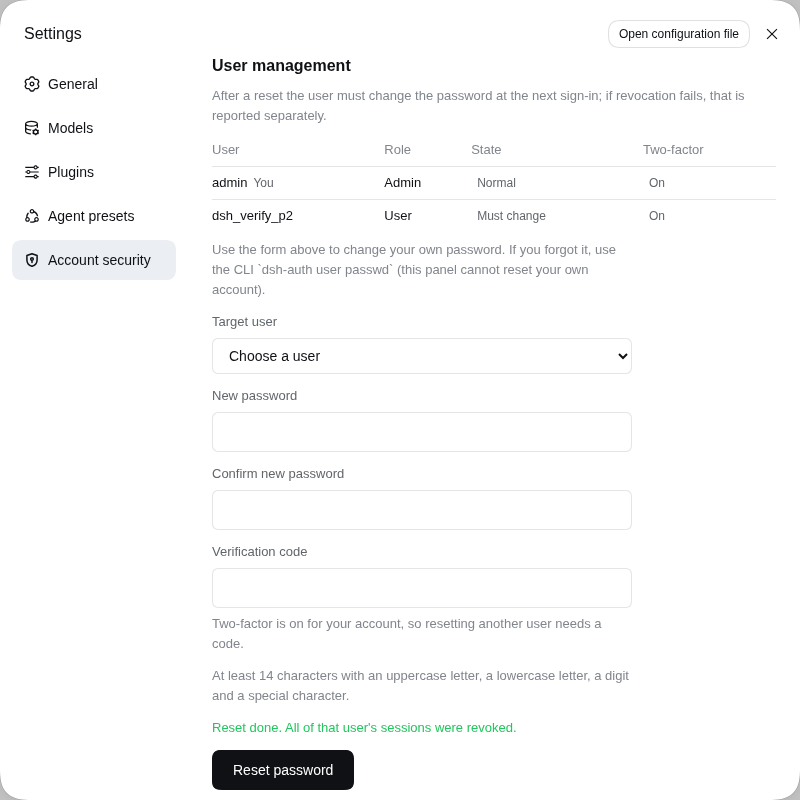

# dsh-auth-gate

[English](README.md) | **简体中文**

[](https://www.npmjs.com/package/dsh-auth-gate)
[](https://www.npmjs.com/package/dsh-auth-gate)
[](https://www.npmjs.com/package/dsh-auth-gate)
[](https://www.npmjs.com/package/dsh-auth-gate)
[](https://www.npmjs.com/package/dsh-auth-gate)
[](https://github.com/TecFancy/dsh-auth-gate/actions/workflows/ci.yml)
[](LICENSE)

给 [DeepSeek Harness](https://github.com/deepseek-ai/dsh)（dsh）的网页版加一道登录关卡。把它放在公网上
运行的 dsh 实例前面，任何人在登录之前都碰不到你的 agent、聊天会话和 LLM 凭据。

> **在 dsh 官方推出认证功能之前，本仓库会一直维护。** dsh 目前还没有内置登录，这个仓库就是用来补上
> 这个缺口的：我们会跟进 dsh 的新版本（挂载点变化、兼容的版本范围、Linux 与 Windows 双平台 CI）、
> 修复升级引入的问题，并照常发版。等官方认证落地，我们会给出迁移方案，同时继续支持大家仍在使用的
> dsh 版本，不会让任何人留在一个无人维护的 fork 上。

## 目录

- [它能做什么](#它能做什么)
- [它不做什么](#它不做什么)
- [快速开始](#快速开始)
- [效果预览](#效果预览)
- [配置](#配置)
- [命令行工具](#命令行工具)
- [管理工具：列出用户与重置密码](#管理工具列出用户与重置密码)
- [内置配置技能](#内置配置技能)
- [故障排查](#故障排查)
- [部署](#部署)
- [认证本地代理（可选）](#认证本地代理可选)
- [环境要求](#环境要求)
- [注意事项与局限](#注意事项与局限)
- [开发](#开发)
- [许可证](#许可证)

## 它能做什么

- **所有请求都要先登录。** 每个页面、每个 API 调用、每条 WebSocket 连接都会检查登录态。没有有效
  会话的访客会被引导到登录页；API 和脚本请求直接返回 `401`。唯一的例外是
  `GET /manifest.webmanifest`：浏览器请求 Web App Manifest 时不带凭据，所以只开放这一条路径，
  响应里也只有应用名、图标和显示模式。
- **两种登录方式**（配置里二选一）：
  - **密码**（推荐）：每个管理员使用自己的用户名和密码。
  - **令牌**：整个实例共用一个密钥。
- **浏览器和脚本都能用。** 浏览器走登录页；脚本和 curl 带上 `Authorization: Bearer <token>` 就能
  跳过登录页。
- **管理工具。** 密码模式下，管理员可以在设置面板的**「账号安全」**分区里，或通过 HTTP
  （`GET /auth/users`、`POST /auth/users/password`）列出用户、重置他人口令；重置会吊销该用户已有的
  全部会话，并让他在下次登录时先设置新口令，之后才能访问其他任何内容。只有处于正式会话的 admin
  才看得到面板里的管理块；管理面**不允许重置自己**（自己的口令用上方自助表单，忘记了自己的口令才走
  CLI）。
- **可选的两步验证（TOTP）。** 密码模式下，账号里添加了 TOTP 密钥的用户登录时，除了密码还要输入
  验证器应用生成的 6 位验证码（遵循 RFC 6238；配置有 off/optional/required 三档）。
- **默认配置就是安全的。** 密码以哈希形式保存；登录有限速，密码连续输错会临时锁定来源地址；会话
  cookie 带有安全属性；配置缺失或损坏时**直接拒绝访问，而不是悄悄放行**。用户名或密码错误时，
  登录卡片会重新显示，并带上 `Invalid username or password.`：用户名保留，密码需要重新输入。
  触发锁定后（HTTP 429 + `retry-after`），同一张登录卡片会显示需要等待的秒数，并提示该限制只
  针对当前网络；剩余尝试次数**刻意不显示**；浏览器启用了 JavaScript 时，刷新页面也不会再额外
  消耗一次尝试机会。

## 它不做什么

先把边界讲清楚，方便你在安装前判断风险（完整清单和背后的机制见
`docs/deployed/known-limitations_zh.md`）：

- **不等于服务器级安全。** 操作系统账号和配置文件仍需要你自己看管（`auth/users.yaml` 和
  `.credentials.yaml` 生成时权限即为 `0600`）；本插件只守住 dsh 的 **Web** 入口。
- **不是每个改密码入口都会让会话失效。** `dsh-auth user disable` 会阻止该用户今后登录，并吊销其
  已签发的会话（默认 5 秒内生效，见 `revokeSweepMs`）；设置面板里的自助改密会吊销该用户的全部
  会话，管理员在面板里重置他人口令同样如此；CLI 的 `dsh-auth user passwd` 只重写存储的密码哈希。
- **不能替代 HTTPS。** 配置了 `cookieSecure: true`，站点就必须通过 https 提供服务。
- **不是完整的身份提供方（IdP）。** 没有 OAuth/OIDC，没有自助注册，也没有邮件重置；用户一律由
  管理员通过 CLI 创建和管理。

## 快速开始

```sh
# 1. 从 npm 装进你的 dsh profile。
#    自 0.4.1 起，包里声明了 dsh.bundle manifest，`dsh plugin add` 会顺带自动注册挂载
#    （dsh.profile.bundles），不需要再手动添加挂载行：
dsh plugin --profile web add dsh-auth-gate

# 2. 创建管理员账号。
#    `dsh plugin add` 把插件装进 profile 的 node_modules
#    （$DSH_HOME/profiles/web，默认 ~/.dsh/...）；CLI 不会被加入你的 PATH，
#    所以要通过 profile 调用。`dsh plugin` 本身就依赖 pnpm：
printf '%s\n' '选一个强密码' | \
  pnpm --dir "$DSH_HOME/profiles/web" exec dsh-auth user add admin --password-stdin

# 3. 启用密码登录：在 $DSH_HOME/cordis.patch.yml 里覆盖插件配置
#    （仓库自带可直接使用的覆盖模板 deploy/cordis.patch.yml，见下文"配置"；
#    挂载这一步本身不需要手动写 patch 行）

# 4. 重启 dsh，打开站点，就会先要求登录。
```

## 效果预览

本节的截图统一使用**英文界面**：插件自己的面板跟随 GUI 语言，服务端渲染的页面在任何语言下都是
英文，两版 README 因此共用同一套图。

未登录的访客会先看到登录页（登录卡片由插件在服务端渲染，文案固定为英文，与 GUI 语言无关）：



账号启用了 TOTP 两步验证时，登录还有第二步：输入验证器应用里的 6 位验证码（先密码，后验证码）：



登录后进入你的实例：



在 dsh 0.1.2-alpha 及更高版本上（这些版本的页面带有 launch token 校验），登录会自动跨过这道校验：
登录跳转会先经过一次相对地址 `/?token=…` 换取 dsh cookie，然后进入 `/`（细节见
`docs/implemented/impl-launch-token-bridge_zh.md`）。

设置面板里有一个醒目的**「Sign out」（退出登录）**按钮，位置在**Settings → General
（设置 → 通用设置）**页最后一行设置项的下方。它是居中、危险色的实心按钮（16px 门形图标加
本地化文字，配色使用主题 token，深浅色自适应）；文案跟随 GUI 语言切换，用的就是设置页语言切换
那套机制。点击后执行的仍是原有的原生登出流程 `POST /auth/logout?next=/`。

已登录的用户还可以在设置面板的**「Account security」（账号安全）**分区里自助改密码（仅密码模式）：
需要填写当前密码和两次新密码，账号绑定了 TOTP 时再加一次验证码。面板标题旁的图标是本插件自己
设计的（16px 描边风格的盾牌加钥匙孔）。

设置导航里那一枚图标同样来自本插件：宿主目前没有给单个设置分区配图标的接口（`settings.section`
只有 `id`/`order`/`label` 三个字段，导航图标由宿主硬编码的 `navIcon(id)` 决定，第三方分区一律
回退到默认齿轮），所以插件用一层**临时 DOM 垫片**（stopgap）只替换自己那一行，匹配不到时静默
退回齿轮。等 dsh 官方支持 `icon` 选项，这层垫片和它的代码会整体删除（迁移条件见 ADR D24.1）。





面板提交到 `POST /auth/password`（字段为 `current` / `password` / `code`，form-urlencoded 编码）。
修改成功后，**该用户的全部会话都会被吊销，包括发起这次改密的那条会话**；客户端会**立即**把用户
带回登录页并附上原因，登录页会说明为什么被登出（成功提示面板只在浏览器或运行环境拒绝跳转时才会
留在屏幕上，上面的「Sign in again」（重新登录）按钮是那时的退路）：



新密码至少 14 位、须同时包含四类字符，且不能与当前密码相同。启用 TOTP 后，当前 30 秒窗口内已经
用过的验证码会视为重放并拒绝，需要等下一个验证码。

处于正式会话的管理员，还会在上方表单下面看到**用户管理块**：一张只读列表（用户名、角色，以及互斥
的「已禁用 / 需改密 / 正常」状态徽标和两步验证徽标，本人行标「本人 / You」），外加一条针对他人的
重置表单。重置会让目标用户在下次登录时被要求改密，并吊销该用户已有的全部会话；发起重置的管理员
自己的会话不受影响。管理员自己开启了 TOTP 时，重置还需要填写一枚当前验证码。该模块只在
`role === "admin"` 且会话为正式会话（非强制改密受限会话）时渲染，非 admin 客户端**根本不会请求**
用户列表。**不允许重置自己**：服务端会拒绝，下拉也排除本人；管理员若忘记自己的口令，只能在服务器上
用 `dsh-auth user passwd <name>` 重置。





## 配置

bundle 挂载行（id 为 `dsh-auth-gate`，由 `dsh plugin add` 自动插入）使用默认配置：`mode: "token"`，
共享密钥来自环境变量 `DSH_AUTH_TOKEN`。要修改配置，在 `$DSH_HOME/cordis.patch.yml`（或 profile
目录下的 `cordis.patch.yml`）里按 id 覆盖即可；仓库自带可直接使用的覆盖模板
`deploy/cordis.patch.yml`。覆盖条目按 id 定位已经挂载的那一行，**不要再写 `insert`**
（否则插件会被挂载两次）：

```yaml
- id: dsh-auth-gate
  config:
    mode: "password" # "password"（推荐）或 "token"
    totp: "optional" # "off"（默认）、"optional" 或 "required"
    cookieSecure: true # 使用 https 时保持 true
```

| 选项                | 默认值                       | 作用                                                                                                                                                                                                                                                                                                                                                                                                                                       |
| ------------------- | ---------------------------- | ------------------------------------------------------------------------------------------------------------------------------------------------------------------------------------------------------------------------------------------------------------------------------------------------------------------------------------------------------------------------------------------------------------------------------------------ |
| `mode`              | `"token"`                    | `"password"` 为用户名密码登录；`"token"` 为全实例共用一个密钥                                                                                                                                                                                                                                                                                                                                                                              |
| `totp`              | `"off"`                      | 仅密码模式。`"optional"`：绑定了 TOTP 密钥的用户登录时需要密码加验证码；`"required"`：所有用户都必须绑定密钥（没有密钥的用户在密码阶段就得到统一的 401，响应体与密码错误相同，避免暴露账号是否存在）                                                                                                                                                                                                                                       |
| `sessionTtl`        | `604800`                     | 一次登录的有效时长（秒），到期后需要重新登录                                                                                                                                                                                                                                                                                                                                                                                               |
| `cookieName`        | `dsh_auth`                   | 会话 cookie 的名称（一般不需要修改）                                                                                                                                                                                                                                                                                                                                                                                                       |
| `tokenRef`          | `"DSH_AUTH_TOKEN"`           | 仅令牌模式：共享密钥存放在哪个环境变量里                                                                                                                                                                                                                                                                                                                                                                                                   |
| `cookieSecure`      | `true`                       | 只在纯 http 测试环境下设为 `false`                                                                                                                                                                                                                                                                                                                                                                                                         |
| `usersFile`         | `""`                         | 密码模式：用户列表文件的位置，默认 `$DSH_HOME/auth/users.yaml`                                                                                                                                                                                                                                                                                                                                                                             |
| `publicHost`        | `""`                         | 登录页身份区显示的域名（用于防钓鱼，让用户确认"这是哪个实例"）。留空则使用请求头里的 `Host`；反向代理改写了 `Host` 时必须显式配置（例如 Caddy 的 `header_up Host 127.0.0.1:3080`），否则卡片上显示的是回环地址而不是你的公网域名。自 D25 起，它还决定管理与改密端点能否校验 `Origin` 头：`publicHost` 留空时这些端点只接受 `Sec-Fetch-Site: same-origin`，生产部署应当配置它；TLS 终止在反代后面时请写成带 scheme 的形式（`https://host`） |
| `revokeSweepMs`     | `5000`                       | 密码模式：被 `dsh-auth user disable` 禁用的用户，其**已签发**的会话会在多长时间（毫秒）内被吊销。`0` 表示不清理已有会话（此时禁用只拦新登录）                                                                                                                                                                                                                                                                                              |
| `clientIpHeader`    | `""`                         | 限速用的客户端真实 IP 请求头（`x-forwarded-for`；Cloudflare 后面可用 `cf-connecting-ip`）。留空表示完全不读取请求头。只有当请求的对端落在 `trustedProxyCidrs` 内时才会读取；不配置时，同机反代会造成所有客户端共用一个锁定桶（issue #74）                                                                                                                                                                                                  |
| `trustedProxyCidrs` | `["127.0.0.0/8", "::1/128"]` | 哪些对端有权提供 `clientIpHeader`（默认只信任回环；没有地址的对端，例如 Unix socket，视为本地）。无效条目会被丢弃并记 error 日志，信任范围收窄为回环；显式写成 `[]` 表示谁都不信任；`0.0.0.0/0` 和 `::/0` 一律拒绝                                                                                                                                                                                                                         |
| `logoutOrder`       | `1000`                       | 「退出登录」按钮在 设置 → 通用设置 页里的排序值（数值越大越靠下）。如果其他插件注册了更大的值，可以调大这个数                                                                                                                                                                                                                                                                                                                              |

给用户启用 TOTP：运行 `dsh-auth user totp enable <name>`，把打印出的密钥录入验证器应用，或扫描
`otpauth://` URI 二维码（Google Authenticator、1Password 等）。验证码每 30 秒变化一次，前一个和
后一个窗口内的码也接受（容忍时钟漂移）。

## 命令行工具

`dsh-auth` 用于在命令行管理用户：

```sh
dsh-auth user add admin --password-stdin   # 添加用户（加 --admin 直接创建管理员）
dsh-auth user list                          # 列出用户
dsh-auth user passwd admin                  # 修改密码（需要输入两次；不提供 --password 参数）
dsh-auth user role admin user               # 授予/撤销管理员角色：user role <name> <admin|user>
dsh-auth user disable admin                 # 阻止该用户今后登录，并吊销其已登录的会话
dsh-auth user enable admin                  # 重新启用被禁用的用户（只重置口令仍登不进来）
dsh-auth user totp enable admin             # 生成 TOTP 密钥（打印 otpauth:// URI）
dsh-auth user totp disable admin            # 删除 TOTP 密钥
```

全局安装后，`dsh-auth` 会直接出现在 PATH 里；通过 `dsh plugin add` 安装时，可执行文件位于
profile 内，需要经由 profile 调用，详见[快速开始](#快速开始)。

`dsh-auth user passwd` 只重写存储的密码哈希，**不会吊销该用户已经登录的会话**。需要让会话立即
失效时，请使用设置面板里的自助改密；`dsh-auth user disable` 也能阻止今后登录，但已签发的会话要等
周期扫描（`revokeSweepMs`，默认约 5 秒）才会被吊销。

## 管理工具：列出用户与重置密码

密码模式下，管理员可以在设置面板的**「账号安全」**分区里列出用户、重置他人口令，也可以在脚本里
走 **HTTP**（`/auth/users` 是字段白名单列表，`/auth/users/password` 是重置）。两条通路行为一致；
所有已认证的状态变更 POST 都会校验 `Origin`，所以脚本必须显式带上它（没有豁免）：

```sh
# 列出用户（jar 里是管理员会话 cookie）。
curl -s -H "Origin: https://dsh.example.com" -b jar https://dsh.example.com/auth/users

# 重置某人的口令。只有「你自己」的账号启用了 TOTP 时才需要 code。
curl -s -H "Origin: https://dsh.example.com" -b jar \
  -d "target=alice&password=<新口令>&confirm=<新口令>&code=<你自己的验证码>" \
  https://dsh.example.com/auth/users/password
```

缺少 `Origin`、或 `Origin` 与实例不匹配的请求一律以 `403` 拒绝（fail-closed）；唯一被接受的另一个
信号是浏览器自己发的 `Sec-Fetch-Site: same-origin`。反向代理改写了 `Host` 时**必须配置
`publicHost`**：否则服务端推导不出自己的对外来源，改密与重置端点就只认
`Sec-Fetch-Site: same-origin`，而上面的命令行调用并不会带它。**TLS 终止在反代后面时要把
`publicHost` 写成带 scheme 的形式**（`https://dsh.example.com`）：只写 `host:port` 时，scheme 由
连接本身是否为 TLS 推导，反代到插件这一段若是明文，脚本走 `Origin` 通道就会 403（浏览器不受影响）。

重置会把目标账号标记为「必须修改口令」，并吊销该用户已有的全部会话（发起重置的管理员自己的会话
不受影响）。目标用户下次登录会拿到**受限会话**（15 分钟、不续期）：它只能到达插件自己的改密页
`GET /auth/password`，其他一律进不去，包括宿主界面。该页面由服务端渲染，没有 JavaScript 也能用
（零外链、无脚本）；提交时仍然要求当前口令，成功后清除标记并把该用户登出，之后即可正常登录。
重置**不会**改动目标的 TOTP 密钥；重置一个仍处于禁用状态的账号也不会让它登得进来（登录路径恒拒
禁用用户），需要先执行 `dsh-auth user enable <name>`。完整契约见
[D25](docs/decisions/implemented/2026-09-24-admin-password-reset.zh.md)。

## 内置配置技能

本包内置了一份配置速查技能（`.agents/skills/dsh-auth-gate-config/`，内容与本页相同）。把它安装到
用户级技能目录后，部署环境里的 dsh agent 就能直接回答「auth-gate 支持哪些配置」：

```sh
pnpm --dir "${DSH_HOME:-$HOME/.dsh}/profiles/<profile>" exec dsh-auth skill install [--force]
```

该命令会把技能复制到 `$DSH_HOME/skills/dsh-auth-gate-config/`，dsh 的技能发现机制会自动加载。
重复执行且不带 `--force` 时，你对技能的本地修改会被保留；带 `--force` 则从包内重新覆盖。

这是一份**用户专用（user-only）技能**（frontmatter 里的 `disable-model-invocation: true`）：
它不会出现在模型可自动调用的技能目录里，因而不会塞进每一轮 agent 对话；需要查配置时，在技能面板
里手动打开即可（输入框的 `/` 菜单里标记为 `user-only`）。如果希望 agent 能自动回答配置问题，
安装后删掉那个 frontmatter 字段即可。

## 故障排查

### `dsh-auth: command not found`

`dsh plugin --profile web add dsh-auth-gate` 会把包装进 profile 的 `node_modules`
（`$DSH_HOME/profiles/web/node_modules/dsh-auth-gate`，默认 `~/.dsh/...`），但不会往 shell 的
`PATH` 里加任何东西，所以不能直接用命令名调用 CLI。这只影响 CLI，插件本身运行正常。三种办法任选
其一：

1. **经由 profile 调用（推荐）。** `dsh plugin` 本来就依赖 pnpm，这样 CLI 与插件从同一位置解析：

   ```sh
   pnpm --dir "${DSH_HOME:-$HOME/.dsh}/profiles/web" exec dsh-auth user add admin --password-stdin
   pnpm --dir "${DSH_HOME:-$HOME/.dsh}/profiles/web" exec dsh-auth user list
   ```

   想省事的话，每个 shell 会话加一次别名：

   ```sh
   alias dsh-auth='pnpm --dir "${DSH_HOME:-$HOME/.dsh}/profiles/web" exec dsh-auth'
   ```

2. **直接用 node 运行**（运行时不需要 pnpm）：

   ```sh
   node "$DSH_HOME/profiles/web/node_modules/dsh-auth-gate/lib/cli.js" user add admin --password-stdin
   ```

3. **全局安装**，`dsh-auth` 就会进入 PATH：

   ```sh
   npm install -g dsh-auth-gate
   dsh-auth user add admin --password-stdin
   ```

无论用哪种方式调用，CLI 读写的都是同一份共享用户列表（`$DSH_HOME/auth/users.yaml`，找不到时
回退到 `~/.dsh/auth/users.yaml`），也就是插件读取的那份；全局安装的副本只是一个启动器。

## 部署

- [反向代理部署指南](docs/deployed/reverse-proxy_zh.md)：Caddy/nginx 配置、浏览器信任栅栏的坑
  （放在反代后面时设置页返回 `403`，以及为什么只加认证修不好），以及推荐的半外壳拓扑。
- [`docs/deployed/deployment_zh.md`](docs/deployed/deployment_zh.md)：运维清单、验收步骤（A–I）
  和故障诊断。

## 认证本地代理（可选）

> ⚠️ **已知限制（任何 auth-gate 版本都改变不了）**：dsh 的设置页（「设置 → 模型」等）只有在
> **页面来源是回环地址**（`localhost`/`127.x`）时才能编辑。这是 dsh 客户端自身的设计边界
> （`isLoopback` 检查），和认证无关：在域名页面上打开设置弹窗会显示
> "settings are unavailable in this browser"，无法编辑提供方和凭据，升级 dsh-auth-gate 也不会有
> 任何变化。要编辑配置，请使用本节介绍的本地代理，或者直接在服务器上访问
> `http://127.0.0.1:3080`。域名页面上的聊天和模型选择不受影响。

> 半外壳拓扑解决了服务端的 `/api` 栅栏之后，dsh **客户端**仍然要求"页面来源必须是回环地址"；
> `dsh-auth-proxy` 在用户本机提供一个回环页面入口，与 auth-gate 配合使用，让远程编辑配置也全程
> 需要认证，且不修改 dsh 源码。完整设计见
> [docs/deployed/local-proxy_zh.md](docs/deployed/local-proxy_zh.md)。

- 零依赖的 Node 可执行文件（`dsh-auth-proxy`）：只监听 `127.0.0.1`，无状态转发页面和 API，
  把 `events.mux`/`events.host` WebSocket 做隧道转发，并去掉 `Set-Cookie` 里的 `Secure` 属性以
  适配 Safari。
- 认证直接复用 auth-gate（密码模式和令牌模式都可以）：登录页和会话 cookie 原样透传。
- **安全边界（deny-list，Phase 2.1）**：加上 `--mark-proxy` 后，带标记的请求命中
  `host.pickDirectory`/`host.openPath`/`settings.openDocument`/`llm.discoverModels` 时，
  服务端 guard 会返回 403，避免远程认证用户触发宿主的原生能力；未加标记时，行为与没有部署代理时
  完全一致。

```sh
dsh-auth-proxy --listen 127.0.0.1:8443 --target https://your-domain.example --mark-proxy
# 在浏览器打开 http://127.0.0.1:8443 → 登录 →「设置 → 模型」即可编辑
```

systemd 示例：`deploy/systemd/dsh-auth-proxy.service.example`。

## 环境要求

- 服务器上需要 Node ≥ 22.19 和 pnpm。
- dsh `0.1.x`（`engines.dsh` 声明为 `^0.1.0-rc.6 || ^0.1.5-rc.2 || ^0.1.7-alpha.1`）。运行时
  验证过的版本是 `0.1.5-rc.2`（生产）和 `0.1.7-alpha.1`（隔离实例）；`0.1.6-*` 预发布版没有列入
  枚举，因为没有针对它们的版本验证（稳定版 `0.1.6` 由 `^0.1.5-rc.2` 覆盖）。插件使用的是宿主
  自带的 `@deepseek-ai/dsh-storage-domain` 和 `@deepseek-ai/cordis`（两者都是 peer 依赖，不会
  打进包），所以只要 profile 由 dsh 基础包启动，依赖就是齐的。
- dsh 的 `web` profile 处于运行状态（`dsh --profile web`）。
- 如果 `cookieSecure` 为 `true`，站点必须通过 https 提供服务（浏览器会拒绝在纯 http 下使用安全
  cookie）。

## 注意事项与局限

这里只列用户最需要知道的部分；完整清单（含机制和对应的 ADR）见
`docs/deployed/known-limitations_zh.md`。

- 禁用用户只阻止**今后**的登录；已签发的会话由插件周期扫描吊销（`revokeSweepMs`，默认 5 秒内
  生效；设为 `0` 则不清理，只能等 TTL 到期）。
- 登录限速和 TOTP 防重放记录会在服务重启后清零。
- 部署在反向代理后面时，必须配置 `clientIpHeader`（以及 `trustedProxyCidrs`），否则所有客户端
  会共用锁定桶；登录与自助改密的桶是分开的，因此两个功能都会受影响。
- 改密码时，即使"吊销旧会话"这一步失败，接口仍会按成功返回：失败会记入 error 日志，旧 cookie
  到会话 TTL 到期前一直有效。
- `Origin` 校验只覆盖两个已认证的状态变更 POST：`POST /auth/login` 仍只有 `SameSite=Lax` 这一层
  跨站防护；重置若写盘成功但吊销会话失败，仍返回 `200` + `sessionsRevoked:false`（并记 error
  日志），旧 cookie 到会话 TTL 到期前一直有效。
- 重置不会改动目标的 TOTP 密钥；重置一个仍被禁用的账号也不会让它登得进来（登录路径恒拒禁用
  用户），需要先执行 `dsh-auth user enable <name>`。
- 管理员自己没启用 TOTP 时，管理端点是单因素认证；生产环境应给管理员启用 TOTP。
- 本插件只保护 dsh 的 Web 入口；操作系统账号和配置文件需要你自己保持私密。

## 开发

本仓库遵循 [dsh-plugin-framework](https://github.com/TecFancy/dsh-plugin-framework) 的工程约定：
跨 slice 只通过 barrel 引用，以 `npm run verify` 作为门禁链，并保留决策记录（ADR）。`verify`
依次运行 format / lint / no-emdash / slice / lock / decisions / docs / readme-parity / type-check /
覆盖率 80% / build / bundle；测试、构建和发版流程见 `docs/specs/development_zh.md`。

## 许可证

[MIT](./LICENSE)
